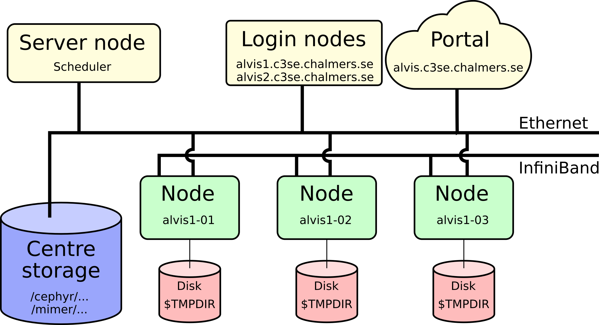
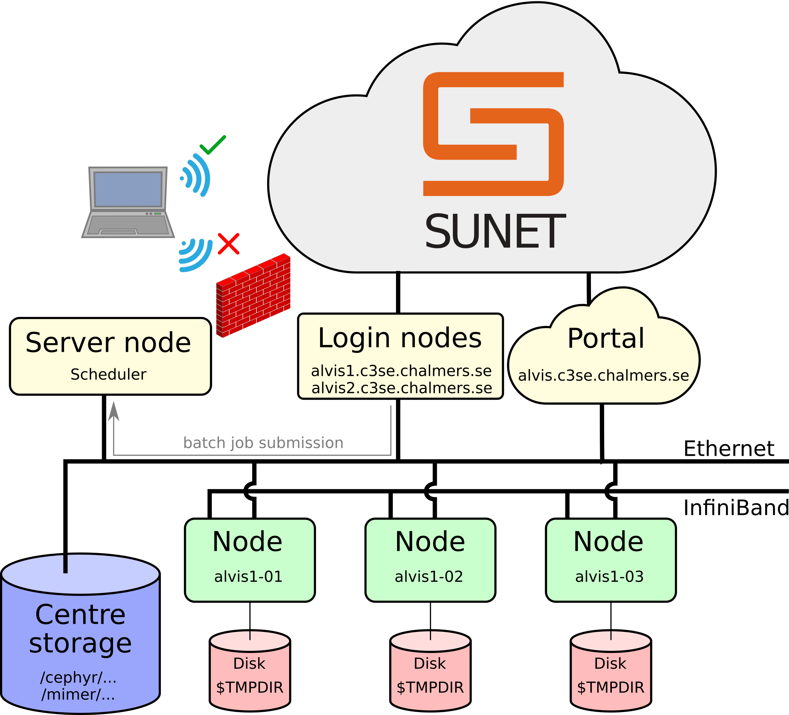
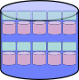
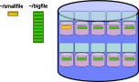
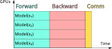
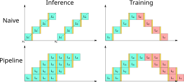

## Scope

<!-- Additional css specific to this presentation -->
<style>
img.cluster_sketch{
  max-width: 80%;
}
</style>

<!-- At some point cover the specifics for Alvis: -->
<!--    - C3SE_quota, where-are-my-files -->
<!--    - job-killing -->
<!--    - job_stats.py -->

- Will be covered:
    - Introduction for running Deep Learning workloads on the main NAISS AI/ML resource
- Will **not** be covered:
    - A general introduction to machine learning
    - Running classical ML or GOFAI
    - General HPC intro

## NAISS GPU resources overview

1. **Alvis** (End-of-life 2026-06-30)
    - NVIDIA GPUs: 332 A40s, 318 A100s, 160 T4s, 44 V100s
    - Only for AI/ML
2. Arrhenius (to be in operation Q2 2026)
    - 1528 NVIDIA GH200s
3. Dardel (Probably end-of-life 2026)
    - 248 AMD MI250X
4. Bianca
    - 20 NVIDIA A100s
    - Only for sensitive data

## Alvis specifics

- What is potentially different on Alvis?
- See extended version at [Alvis introduction material](https://www.c3se.chalmers.se/documentation/first_time_users/intro-alvis/slides/)


{.cluster_sketch}

### Connecting - Firewall

- Firewall limits connections to within
  [SUNET](https://www.sunet.se/om-sunet/anslutna-organisationer)
- Use a [VPN](https://www.c3se.chalmers.se/documentation/connecting/#vpn) if needed

{.cluster_sketch}

### Log-in nodes

- `alvis1.c3se.chalmers.se` has 4 T4 GPUs for light testing and debugging
- `alvis2.c3se.chalmers.se` is dedicated data transfer node
- Will be restarted from time to time
- Login nodes are shared resources for all users:
    - don't run jobs here,
    - don't use up too much memory,
    - preparing jobs and
    - light testing/debugging is fine

### SSH - Secure Shell

- `ssh <CID>@alvis1.c3se.chalmers.se`, `ssh <CID>@alvis2.c3se.chalmers.se`
- Gives command line access to do anything you could possibly need
- If used frequently you can set-up a password protected
  [SSH-key](https://www.c3se.chalmers.se/documentation/connecting/ssh/#setting-up-ssh-key) for convenience

### Alvis Open OnDemand portal

- <https://alvis.c3se.chalmers.se>
- Browse files and see disk and file quota
- Launch interactive apps on compute nodes
    - Desktop
    - Jupyter notebooks
    - MATLAB proxy
    - RStudio
    - VSCode
- Launch apps on log-in nodes
    - TensorBoard
    - Desktop
- See our [documentation](https://www.c3se.chalmers.se/documentation/connecting/ondemand/) for more

### Remote desktop

- RDP-based remote desktop solution on shared login nodes (use portal for
  heavier interactive jobs)
- In-house-developed web client:
    - <https://alvis1.c3se.chalmers.se>
    - <https://alvis2.c3se.chalmers.se>
- Can also be accessed via any desktop client supporting RDP at
  `alvis1.c3se.chalmers.se` and `alvis2.c3se.chalmers.se` (standard port 3389).
- Desktop clients tend to offer better quality and more ergonomic experiences.
- See
  [the documentation](https://www.c3se.chalmers.se/documentation/connecting/remote_graphics/#rdp-support)
  for more details

### Files and Storage

- `/cephyr/` and `/mimer/` are parallel filesytems, accessible
  from all nodes
- Backed up home directory at `/cephyr/users/<CID>/Alvis`
- Project storage at `/mimer/NOBACKUP/groups/<storage-name>`
- The `C3SE_quota` shows you all your centre storage areas, usage and quotas.
    - On `/cephyr` see file usage with `where-are-my-files`
- File-IO is usually the limiting factor on parallel filesystems
- Prefer a few large files over many small

### Datasets

- When allowed, we provide popular datasets at `/mimer/NOBACKUP/Datasets/`
- To request an additional dataset, do so through the [support form](https://supr.naiss.se/support/?problem_type=other&centre_resource=r75)
- It is your responsibility to make sure you comply with any licenses and limitations
    - In all cases only for non-commercial research applications
    - Citation often needed
- Read more on the [dataset](https://www.c3se.chalmers.se/documentation/software/machine_learning/datasets/) page and/or the respective README files

### Software

- [Containers](https://www.c3se.chalmers.se/documentation/miscellaneous/containers/) through Apptainer
- Optimized software in [modules](https://www.c3se.chalmers.se/documentation/module_system/modules/)
    - Flat module scheme, load modules directly
- Read the [Python instructions](https://www.c3se.chalmers.se/documentation/module_system/python/) for installing your own Python packages

### GPU hardware details

<!-- This table is also used in about/Alvis -->

| #GPUs | GPUs    | Capability | CPU     | Note       |
|-------|---------|------------|---------|------------|
| 44    | [V100](https://images.nvidia.com/content/technologies/volta/pdf/volta-v100-datasheet-update-us-1165301-r5.pdf)    | 7.0        | Skylake |            |
| 160   | [T4](https://www.nvidia.com/content/dam/en-zz/Solutions/Data-Center/tesla-t4/t4-tensor-core-datasheet-951643.pdf)      | 7.5        | Skylake |            |
| 332   | [A40](https://images.nvidia.com/content/Solutions/data-center/a40/nvidia-a40-datasheet.pdf)     | 8.6        | Icelake | No IB      |
| 296   | [A100](https://www.nvidia.com/content/dam/en-zz/Solutions/Data-Center/a100/pdf/nvidia-a100-datasheet-nvidia-us-2188504-web.pdf)    | 8.0        | Icelake | Fast Mimer |
| 32    | [A100fat](https://www.nvidia.com/content/dam/en-zz/Solutions/Data-Center/a100/pdf/nvidia-a100-datasheet-nvidia-us-2188504-web.pdf) | 8.0        | Icelake | Fast Mimer |

### SLURM specifics

- Main allocatable resource is `--gpus-per-node=<GPU type>:<no. gpus>`
    - e.g. `#SBATCH --gpus-per-node=A40:1`
- Cores and memory are allocated proportional to number of GPUs and related node type
- Maximum 7 days walltime
    - Use checkpointing for longer runs
- Jobs that don't use allocated GPUs may be automatically cancelled

### GPU cost on Alvis

| Type    | VRAM | System memory per GPU | CPU cores per GPU | Cost |
| ------- | ---- | --------------------- | ----------------- | ---- |
| T4      | 16GB | 72 or 192 GB          | 4                 | 0.35 |
| A40     | 48GB | 64 GB                 | 16                | 1    |
| V100    | 32GB | 192 or 384 GB         | 8                 | 1.31 |
| A100    | 40GB | 64 or 128 GB          | 16                | 1.84 |
| A100fat | 80GB | 256 GB                | 16                | 2.2  |

- Example: using 2xT4 GPUs for 10 hours costs 7 "GPU hours" (2 x 0.35 x 10).
- "Cost" is proportional to actual price of the hardware.

### Monitoring tools

- You can SSH to nodes where you have an ongoing job
    - From where you can use CLI tools like `htop`, `nvidia-smi`, `nvtop`, ...
- Use `job_stats.py <JOBID>` to view graphs of usage
- `jobinfo -s` can be used to get a summary of currently available resources

## Running ML

- How you run on GPUs with PyTorch and TensorFlow

### PyTorch

- Move tensors or models to the GPU "by hand"

```python
import torch

device = "cuda" if torch.cuda.is_available() else "cpu"
a = torch.Tensor([1, 1, 2, 3]).to(device)
```

<!--    - Software recap -->
<!--    - SLURM recap and allocating GPUs on NAISS SLURM clusters -->
<!--    - Basic checkpointing for long running jobs (Do I want PyTorch lightning?, Yes, use it for this example at least) -->

### PyTorch Lightning

- Lightning is wrapper to hide PyTorch boilerplate
- `Trainer` and `LightningModule` handles moving data/model to GPUs

```python
import lightning as L
import torch


class LightningTransformer(lightning.LightningModule):
    def __init__(self, ...):
        super().__init__()
        self.model: torch.nn.Module = ...

    def training_step(self, batch, batch_idx): ...

    def configure_optimizers(self): ...
```

### Pytorch and PyTorch Lightning Basic Demo

- [Demo](demos/pytorch/basics.html)

### TensorFlow

- Automatically tries to use a single GPU
- Will also pre-allocate GPU memory, hiding actual memory usage to external monitoring tools
- <https://www.tensorflow.org/guide/gpu>
- Demo <!-- TODO - [Demo](demos/tf/basics.html) -->

```python
import tensorflow as tf

print(tf.config.list_physical_devices("GPU"))
```

## Performance and GPUs

- What makes GPUs good for AI/ML?
- And what to think about to get good performance out of it?

### General-Purpose computing on GPUs

- Single Instruction Multiple Threads
    - Massively parallel on 1000s to 10000s of threads
- Specialised Matrix-Multiply Units (Tensor Cores)
    - Most DL architectures can be reduced to mostly GEneral Matrix Multiplications

### Precision and performance (×10¹² OP/s)

| Data type | GH200    | **A100** | **A40**   | **V100** | **T4** |
| --------: | -------- | -------- | --------- | -------- | ------ |
|      FP64 | 34       | 9.7      | 0.58      | 7.8      | 0.25   |
|      FP32 | 67       | 19.5     | 37.4      | 15.7     | 8.1    |
|      TF32 | 494\*²   | 156\*²   | 74.8\*²   | N/A      | N/A    |
|      FP16 | 990\*²   | 312\*²   | 149.7\*²  | 125      | 65     |
|      BF16 | 990\*²   | 312\*²   | 149.7\*²  | N/A      | N/A    |
|       FP8 | 1979\*²  | N/A      | N/A       | N/A      | N/A    |
|      Int8 | 1979\*²  | 624\*²   | 299.3\*²  | 64       | 130    |
|      Int4 | N/A      | 1248\*²  | 598.7\*²  | N/A      | 260    |

### TensorCores for GEMM computations

- FP32 mixed precision GEMM computations with TF32
    - TensorFlow does this by default
    - PyTorch only for convolutions by default
    - [`torch.set_float32_matmul_precision('high')`](https://docs.pytorch.org/docs/stable/generated/torch.set_float32_matmul_precision.html) to enable for matmul
- Tensor dimensions must be multiple of 8

### Automatic Mixed Precision

- Calculate with float16 when possible
- Uses loss scaling to not loose small gradient values
- Read more: [source](https://docs.nvidia.com/deeplearning/performance/mixed-precision-training/index.html#amp), [NVIDIA](https://developer.nvidia.com/automatic-mixed-precision), [PyTorch](https://docs.pytorch.org/docs/stable/amp.html), [TensorFlow](https://www.tensorflow.org/guide/mixed_precision)

### Tensor Core Shape Constraints

- To use TensorCores in FP16 precision the following should be in a multiple of 8 in FP16 ([source](https://docs.nvidia.com/deeplearning/performance/mixed-precision-training/index.html#tensor-core-shape)):

1. Mini-batch
2. Linear layer width/dimension
3. Convolutional layer channel count
4. Vocabulary size in classification problems (pad if needed)
5. Sequence length (pad if needed)

### Arithmetic Intensity

- Computational work in a CUDA kernel per input byte
- If too low you're memory bound
- To increase:
    - Concatenate tensors when suitable for larger inputs to layers
    - Use [channels last format](https://docs.pytorch.org/tutorials/intermediate/memory_format_tutorial.html#performance-gains) for conv layers
    - Wider layers (but only if it makes sense)

### Don't Forget Non-Tensor Core Operations

- Non-Tensor Cores operations are up to 10x slower
    - Optimising/reducing these can give most overall improvement
- Compiling models can help (JIT, XLA)

### GPU monitoring

- `nvtop` & `nvidia-smi`
    - utilization: percent of time any SM is used (not percent of SMs used)
- `job_stats.py JOBID` (Alvis/Vera only)
    - power consumption as proxy for occupancy
- See profiling section later for more detailed results

<!-- ### Programming with precision -->
<!--  -->
<!-- <!--    - Mixed precision and how to select precision in PyTorch and TensorFlow --> -->
<!-- - PyTorch -->
<!-- - TensorFlow -->

## Performance and parallel filesystems

- Performance considerations for data loading on parallel filesystems
<!--    - Explain parallel filesystems or at least talk about FileIO -->
<!--    - What to show? Arrow, Zip -->
<!--    - Demos -->

### The parallel filesystem



### Striping on parallel filesystems



### Small vs big files



### Performance suggestions
- Prefer a few large files over many small
  - Many good implementations: HDF5, NetCDF, Arrow, Safetensors, ...
- Containers are faster for python environments on start-up

<!-- ### Tiered storage and caching -->
<!-- - Storage on Alvis is tiered -->
<!--   - Recently used files is probably on faster tier -->
<!--   - (On Arrhenius placement will probably be fixed) -->
<!-- - Nodes cache recently read files in memory (if there is space) -->
<!--   - If dataset easily fits into memory, only first epoch is slow -->

## Profiling

- Profiling your ML workload
<!--    - Print statements with timestamps? -->
<!--    - Figure out how PyTorchs new replacement work and get something useful from that -->
<!--    - TensorFlow + TensorBoard -->
<!--    - Scalene? Others? -->
<!--    - Demos -->

### Print "profiling""

- First thing to try, print what you want to know
  - Run with `python -u` for unbuffered mode

```python
import time

t0 = time.time()
...  # your code here
print(f"ran ... in {time.time() - t0} s")
```

### Scalene

- General sampling Python profiler for both CPU, GPU and memory
- Jupyter: `%load_ext scalene` + `%%scalene`
- Lightning: [Issue, solved in](https://github.com/plasma-umass/scalene/pull/977) Scalene >= v2.1.0

```bash
python -m scalene run my_script.py
python -m scalene --cli
```

<!-- Queue demo -->

### PyTorch profiler

```python
# Plain PyTorch https://docs.pytorch.org/tutorials/recipes/recipes/profiler_recipe.html
from torch.profiler import profile
with profile(...) as prof:
  ...  # run the code you want to profile
print(prof.key_averages().table())
prof.export_trace("trace.json")

# PyTorch Lightning https://lightning.ai/docs/pytorch/stable/api_references.html#profiler
trainer = Trainer(..., profiler="pytorch")
...
```

- use <https://ui.perfetto.dev/> to view JSON trace files

<!-- Queue demo -->

### TensorFlow profiler and TensorBoard

- [Install](https://www.tensorflow.org/guide/profiler#install_the_profiler_and_gpu_prerequisites) `tensorboard_plugin_profile`
- [Use TensorBoard callback](https://www.tensorflow.org/guide/profiler#collect_performance_data)

```python
# Profile from batches 10 to 15
tb_callback = tf.keras.callbacks.TensorBoard(log_dir=log_dir,
```

<!-- Queue demo -->

## Multi-GPU parallelism

- Task parallelism
  - Embarassingly parallel
- Data parallelism, for speed-up
  - For speed-up when single GPU efficiency is already good
- Flavours of model parallelism
  - When the model doesn't fit on the GPU

### Task parallelism

- When little to no communication is needed
  - Inference on different data
  - Training with different set-up (e.g. hyperparameter tuning)
- Use [job-arrays](https://www.c3se.chalmers.se/documentation/submitting_jobs/running_jobs/#running-job-arrays) or [task farms](https://www.c3se.chalmers.se/documentation/miscellaneous/hyperqueue/)

### Distributed Data Parallelism

- Copy the model to each GPU and feed them different data
  - Communicate gradient updates (all-reduce)



### Pipeline parallelism



### Tensor Parallelism

- [Megatron LM paper](https://doi.org/10.48550/arXiv.1909.08053) paired row and column parallel layers

$$
  \begin{aligned}
    x_{\cdot i}^{(n+1)} &= \mathrm{Act}\left(x^{(n)}l^{(n)}_{{\cdot}i} + b^{(n)}_{\cdot i}\right), \\
    x^{(n+2)} &= \mathrm{Act}\left(\mathrm{AllReduce}_i\left( x^{(n+1)}_{{\cdot}i}l^{(n+1)}_{i\cdot}\right) + b^{(n)}\right).
  \end{aligned}
$$


### Fully Sharded Data Parallel

- Not available in TensorFlow
- All parameter tensors are fully distributed (Fully Sharded)
- Each GPU computes their own mini-batch (Data Parallel)

### PyTorch

- [Overview](https://docs.pytorch.org/tutorials/beginner/dist_overview.html)
- [Distributed Data Parallel](https://docs.pytorch.org/docs/stable/generated/torch.nn.parallel.DistributedDataParallel.html)
- [Fully Sharded Data Parallel](https://docs.pytorch.org/tutorials/intermediate/FSDP_tutorial.html)

<!-- Queue demo x2 -->

## Basic LLM inference

- vLLM
<!--    - find_ports  -->
<!--    - chat mode  -->
<!--    - batch mode  -->
<!--    - model parallelism -->
<!--    - for more recommend NAISS LLM Workshop -->
